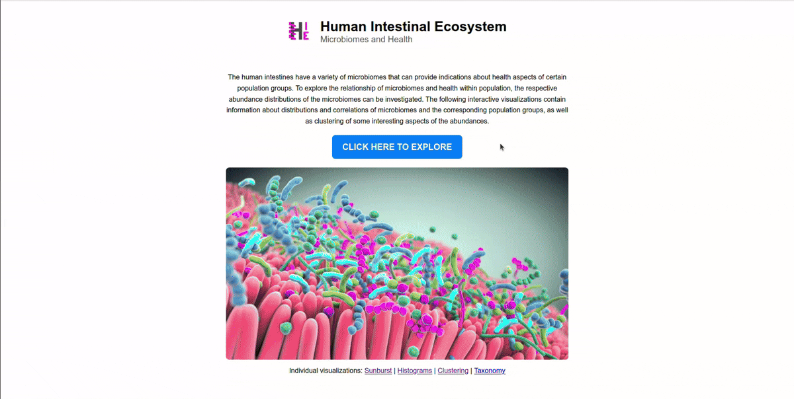

# Microbiome Visualization App

An interactive web application for exploring microbiome distributions and their correlation with population health factors. Built as a data-driven visualization tool with a focus on clarity, usability, and responsive design.

## Purpose

The human gut contains a rich microbiome whose composition can reflect or influence various aspects of population health. This project provides interactive visualizations to:

- Explore microbiome abundance distributions
- Investigate correlations between microbial species and population groups
- Reveal patterns and clusters in microbiome data

---

## Live Demo 
#### Try it live on Render:
[human-intestinal-ecosystem.onrender.com](https://human-intestinal-ecosystem.onrender.com/landing_page)
 
#### Watch the demo video:

---

## Tech Stack

- **Frontend**: JavaScript, D3.js, HTML5, CSS3
- **Backend**: Flask (Python)
- **Data Handling**: Pandas, Numpy, sklearn, JSON
- **Visualization**: D3.js interactive SVGs
- **Containerization**: Docker, Docker Compose v2
- **Deployment**: Render
<!-- - **CI/CD**: GitHub Actions -->
- **Version Control Workflow**: Git, feature branches, pull requests

---

## Authorship & Contributions

#### [Leonard Siegert] (https://github.com/leonardsiegert)
- Clustering visualizations and interactive selection (D3.js)
- Histogram visualization (co-developed)
- Data preprocessing and project structure organization
- Responsive design for mobile and desktop
- Flask server co-development and GitHub management
- Dockerization and CI/CD setup
- README writing

#### [Dexter Früh] (https://github.com/dexterfrueh)
- Sunburst and tree visualizations (D3.js)
- Histogram visualization (co-developed)
- Side-by-side layout and selection syncing across views
- Code cleanup and documentation with docstrings
- Flask server co-development and GitHub management

We followed a real-world Git workflow: using feature branches, code reviews, and pull requests to simulate a professional development process.

---

## What We Learned

- Designing mobile-responsive data visualizations with D3
- Collaborative software engineering practices via GitHub
- Building production-ready Flask apps with Docker
- Deploying containerized apps on cloud platforms like Render
<!-- - Managing CI/CD workflows with GitHub Actions -->
- Writing clear documentation and modular code

---

## Run the Project

### Clone the repository

```bash
git clone git@github.com:leonardsiegert/human-intestinal-ecosystem.git
cd human-intestinal-ecosystem
```

### Using Docker (Recommended)

#### Run the production Server:
```bash
docker compose up --build prod
```
This starts the production web server (Gunicorn) at http://localhost:8000.

#### Start a Development Environment:
```bash
docker compose run --build --service-ports dev bash
```
This opens an interactive terminal in the container.

From there, you can:

#### Run the development Flask server:
```bash
python app/app.py
```
#### Launch Jupyter Notebook:
```bash
cd data
jupyter notebook --ip=0.0.0.0 --port=8888 --allow-root
``` 
Then open http://localhost:8888 in your browser.

#### Shut down the containers:
```bash
docker compose down
```

#### One-Click Setup in VS Code (Optional)

If you use Visual Studio Code, you can launch a fully-configured containerized environment instantly:
1. Install the Dev Containers extension
2. Open this repository in VS Code
3. When prompted, select "Reopen in Container"

This will:
- Build and start the Docker development container
- Mount the project inside
- Forward ports (Flask, Gunicorn, Jupyter)
- Install recommended extensions for Python and Jupyter

### Using A Virtual Environment

### 1. Create and activate a virtual environment
With conda:

```bash
conda create --name venv pip
conda activate venv
```
Otherwise:
```bash
python3 -m venv venv
source venv/bin/activate     # On Windows: venv\Scripts\activate
```

### 2. Install Python dependencies

```bash
pip install -r requirements.txt
```

### 3. Start the Flask server

For development server:

```bash
python app/app.py
```

Then open http://localhost:5000 in your browser.

For production server:

```bash
gunicorn app.app:app
```
Then open http://localhost:8000 in your browser.

---
## Data & Licensing
### Microbiome Dataset

#### Source:
Lahti, L. et al. Tipping elements in the human intestinal ecosystem. Nat. Commun. 5:4344 doi: 10.1038/ncomms5344 (2014).\
Via datadryad: https://doi.org/10.5061/dryad.pk75d

#### License:
The data is in the public domain — you are free to copy, modify, distribute, and use the data for any purpose, including commercial use, without asking permission: \
https://creativecommons.org/publicdomain/zero/1.0/

### Code License

This project is licensed under the [GNU General Public License v3.0](./LICENSE)

You are free to use, modify, and distribute this software under the same license, provided you disclose source code and keep derivative works open.

<!-- ## Future Work

- Add filtering by species or metadata (e.g. age, diet)

- Include time-series microbiome data (longitudinal tracking)

- Improve accessibility and mobile usability

- Add user-upload feature for custom datasets -->
